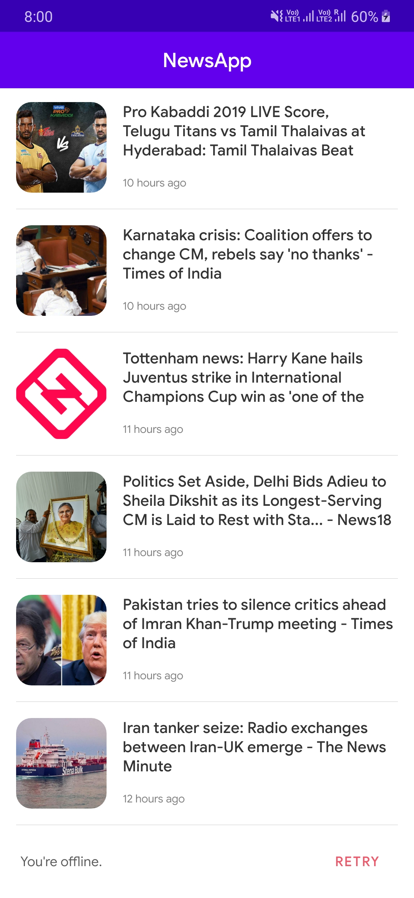

# NewsApp

NewsApp is android application based on **MVVM architecture**, loads the popular news headlines from [NewsAPI.org](https://newsapi.org).

The application get the content from the [NewsAPI.org](https://newsapi.org), display it and store it on the device for work in offline mode.

## Screenshots:

## Architecture and Tech-stack:

1. Based on **MVVM architecture** and repository pattern.
2. Uses Android Architecture Components, like **ViewModel, LiveData, Paging, Room**.
3. **Android Dagger2** for dependency injection.
4. A repository that works with the database and the api service, providing a unified data interface.
5. App uses Room for managing a local SQLite database, which means that you don't need internet connection to see already loaded data.
6. Uses **RxJava and Retrofit** for network calls and transformations.
7. Uses **Glide** for image loading.
8. The application support **phone and tablet** by using fragments. In phone the fragment change by click on some item in the list. In tablet they display side by side, and the details fragment change the content by item click.

## How to build on your environment

1. Clone
2. Get the API key from  [NewsAPI.org](https://newsapi.org/)
3. Add your api key (gradle.properties)
4. Build
5. Test

## Used libraries:

- [Android architecture components](https://developer.android.com/topic/libraries/architecture/index.html)
- [Room Persistence Library](https://developer.android.com/topic/libraries/architecture/room.html)
- [RxJava2](https://github.com/ReactiveX/RxJava)
- [Dagger2](https://github.com/google/dagger)
- [RxAndroid](https://github.com/ReactiveX/RxAndroid)
- [Retrofit2](https://github.com/square/retrofit)
- [Glide](https://github.com/bumptech/glide)

## License

GNU General Public License v3.0
